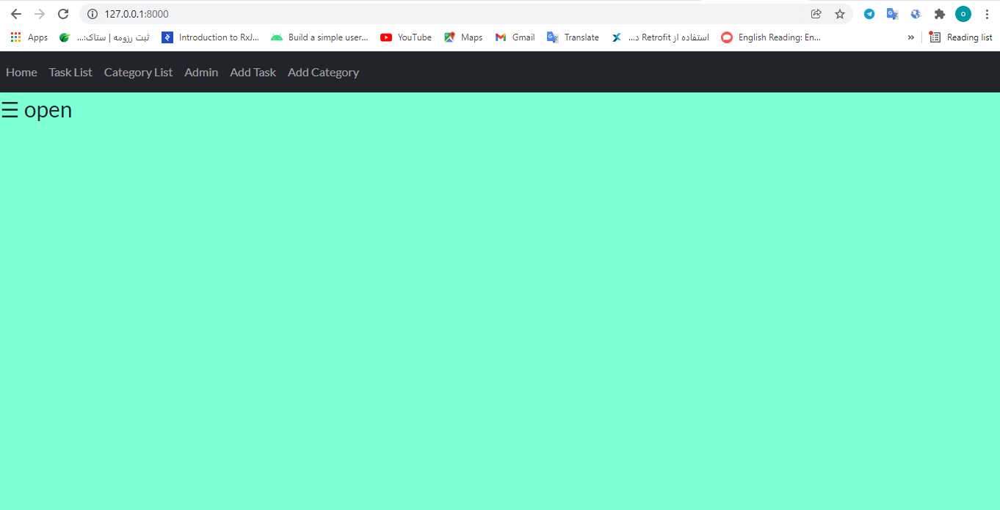
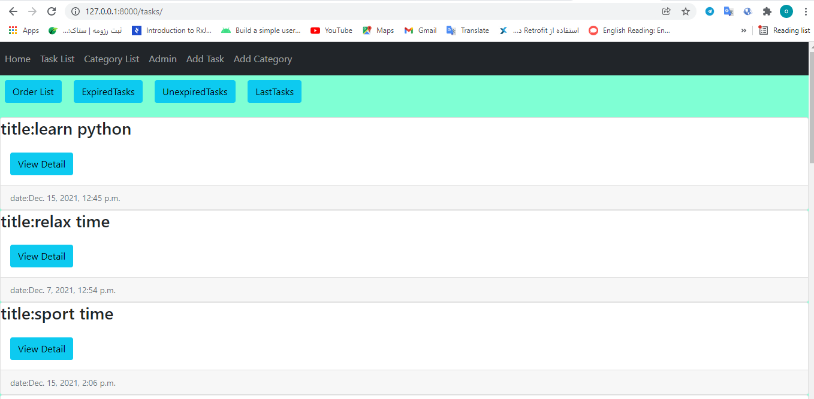
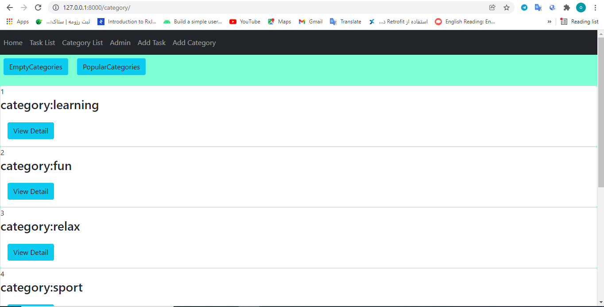
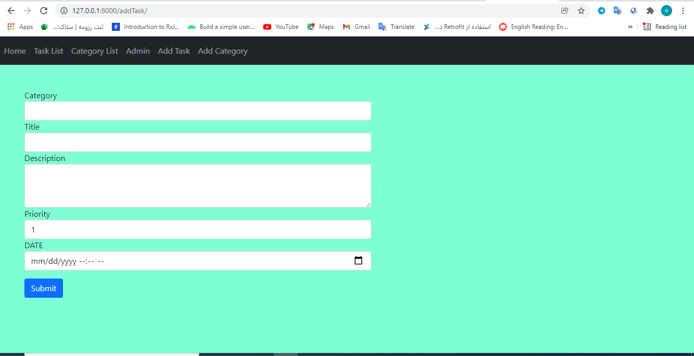
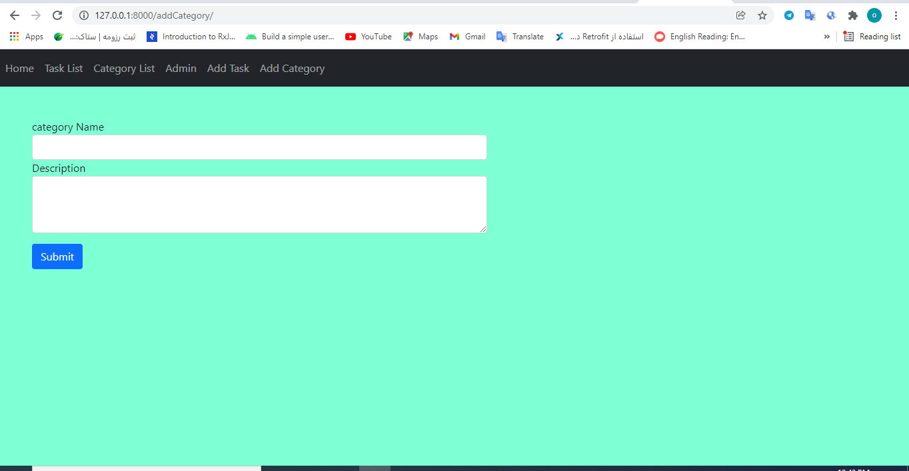

# Python-django-Reminder
* Reminder with ajax and django api
## :page_facing_up: Table of contents
* [:books: General info](#books-general-info)
 * [:camera: Screenshots](#camera-Screenshots)
  * [:floppy_disk: Setup](#floppy_disk-setup)
## :books: General info
* this is Reminder project . user can add task and category and see expired tasks, unexpired tasks ,order tasks base on date,  see last 3 tasks, see popular ctaegory ,...
* this project using ajax for post data to db and get data from api.
## :camera: Screenshots

## :floppy_disk: Setup
* [Install Python](https://docs.python-guide.org/starting/installation/)
* [Install Django](https://docs.djangoproject.com/en/3.1/howto/windows/) by typing `pip install Django`
* open project
* Run `python manage.py makemigrations` for changes to models etc.
* Run `python manage.py migrate` to migrate the migration files.
* To add a superuser run `python manage.py createsuperuser
* Run `python manage.py runserver` to run server on port 8000
